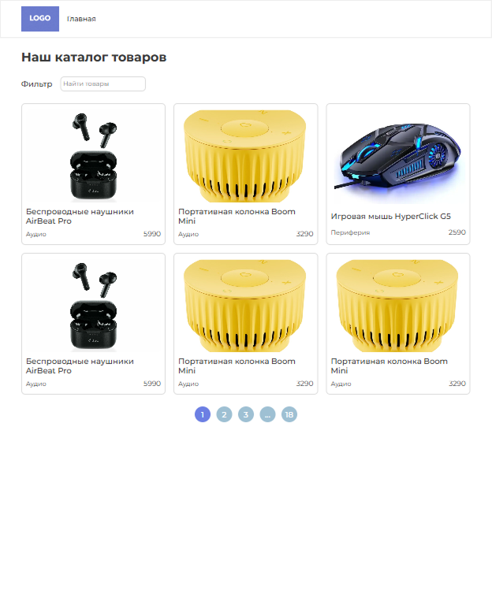
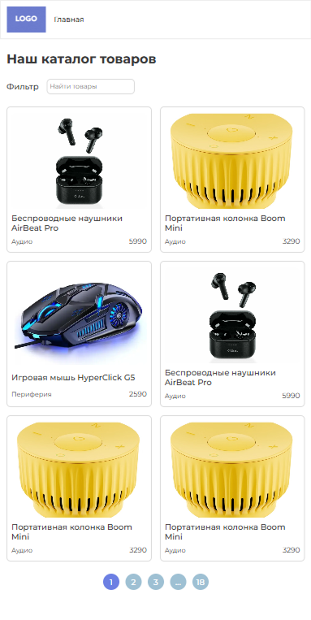
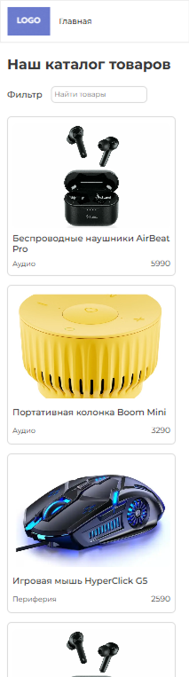
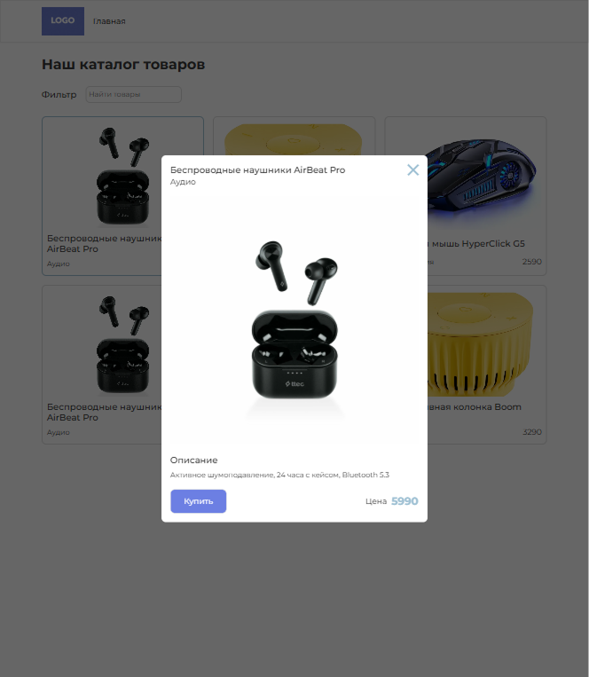
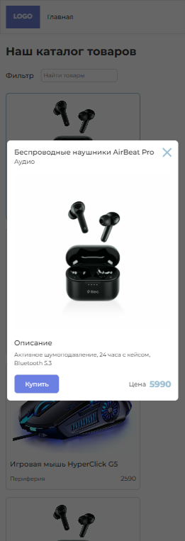

# Store Project

**Тестовое задание:**

Создать небольшое одностраничное приложение, которое выводит список товаров, позволяет отфильтровать их по названию и посмотреть подробную информацию о выбранном товаре в модальном окне.

Что должно работать:

- Главная страница — выводит карточки товаров (изображение, название, цена).
- Поиск — текстовое поле, которое фильтрует товары по названию «на лету».
- Модальное окно — при клике на карточку открывается всплывающее окно с полной информацией о товаре (большое изображение, описание, цена, кнопка «Купить»). Окно закрывается по кнопке «X», по клику вне окна и по клавише Esc.
- API-запрос — данные о товарах берутся из имитированного endpoint-а. Пример структуры:
```
[
  {
    "id": 1,
    "title": "Смарт-часы X100",
    "price": 7490,
    "category": "Гаджеты",
    "image": "https://example.com/img/1.jpg",
    "description": "Водонепроницаемые, GPS, 7-дневный аккумулятор"
  },
  ...
]
```
- Адаптивность — макет должен корректно выглядеть на мобильных (≤ 480 px), планшетах (≤ 768 px) и десктопе.
- Git — весь код находится в репозитории, сделаны минимум 3 коммита (инициализация, добавление UI, добавление логики)

## Содержание
- [Запуск проекта](#запуск-проекта)
- [Стек](#стек)
  - [Backend](#backend)
  - [Frontend](#frontend)
- [API (backend)](#api-backend)
- [Client](#client)
  - [Роль Redux Toolkit и RTK Query](#роль-redux-toolkit-и-rtk-query)
  - [Типизация Данных Product](#типизация-данных-product)
  - [Фильтрация товаров](#фильтрация-товаров)
  - [Контроллер пагинации](#контроллер-пагинации)
  - [Модальное окно](#модальное-окно)
  - [CSS modules, SCSS, Адаптивность](#css-modules-scss-адаптивность)
- [Скриншоты веб-приложения](#скриншоты-веб-приложения)

## Запуск проекта

### Backend

- npm install

- npm run dev

###  Frontend

- npm install

- npm start

## Стек

### Backend
- Node.js + Express
- CORS
- Данные: `data/data.json`
- Картинки: `data/images/*` (раздача статики)

### Frontend
- React + TypeScript
- Redux Toolkit + RTK Query
- SCSS Modules
- Архитектура: Feature-Sliced Design (FSD)


## API (backend)

Модель данных сущности товара Product:

```
export interface ProductCardModel {
    id: number;
    title: string;
    price: number;
    category: string;
    imageUrl: string;
    description: string;
}
```

API слушает по умолчанию порт 8080.

Endpoint сущности Product: `GET /api/product?pageNumber=value&pageSize=value&search=value`

У Endpoint'а три параметра: pageNumber, pageSize, search. Также в коде присутствует функция sortData, которая сортирует массив данных Product в соответствии с поисковым параметром search(при его наличии). Как результат, клиент получает в ответном body постраничный и отфильтрованный набор данных.

Ответ от API отправляется в формате:

```
export interface ProductResponse {
    pages: Record<number, ProductCardModel[]>
    total: number;
}
```

## Client

Frontend слушает по умолчанию 3000 порт.

В качестве архитектуры frontend была выбрана слоистая архитектура FSD. В силу своего удобства и масштабируемости.

Как результат структура выглядит следующим образом: app, entities, features, pages, shared, widgets.

`shared/ui` содержит вспомогательные переиспользуемые блоки, такие как

- Button - кастомная кнопка
- ItemsGrid - grid сетка
- Modal
- PageDot - кнопка переключения по страницам товаров
- Paragraph

`entities/Product`

В данном месте хранится все что связано с сущностью Товара. В папке ui все что отображает товар: виджет(ProductWidget), карточка(ProductCard) и т.п.

model: types - типы, api - redux логика.

#### Роль Redux Toolkit и RTK Query

RTK query используется для запросов к backend, кэширования. Глобальный стор инициализирован в `app/store/store.ts`. RTK apiService в `shared/api/rtkApiService`

В результате был написан Query Hook похожий на Infinity Query(`entities/Product/model/api/productApi.ts`), за исключением того, что есть полный контроль за номером текущей и следующей страницы.

#### Типизация Данных Product

Как и было описано выше, но более подробно, типы выглядят следующим образом:

```
export interface ProductQueryParams {
    pageNumber: number;
    pageSize: number;
    search: string;
}

export interface ProductResponse {
    pages: Record<number, ProductCardModel[]>
    total: number;
}

export interface ProductCardModel {
    id: number;
    title: string;
    price: number;
    category: string;
    imageUrl: string;
    description: string;
}
```

#### Фильтрация товаров

Фильтрация Product реализована в компоненте Filters(`features/Filter`). Компонент в пропсах принимает useState и через input его изменяет. А фильтрация самого набора данных происходит на стороне backend, чтобы не нагружать устройство пользователя.

#### Контроллер пагинации

Контроллер пагинации реализован в компоненте PaginationController(`entities/Product/ui/PaginationController`). При изменении useState currentPage(текущей страницы просмотра товаров) в цикле происходит пересчет массива навигации по страницам с шагом 2. (например если текущая страница 4, то видимость пользователя будет: firstPage ... 2 3 4 5 6 ... lastPage)

#### Модальное окно

Модалка рендерится через `createPortal` в `document.body`. При открытии блокируется скролл страницы и добавляется обработчик `keydown` для закрытия по `Esc`. Закрытие также работает по клику на оверлей и по кнопке `X`.

Глобальная функция закрытия `onCloseHandle` содержит таймер, который контролирует срабытывание всех стилей/анимаций до фактического пропадания модального окна из DOM-дерева.

Также стоит отметить, что модальное окно не попадает в DOM-дерева при `isOpen=false` из-за проверки `isMounted`.

#### CSS modules, SCSS, Адаптивность

В качестве стилей были использованы модульные классы. Также стоит отметить, что были использованы такие базовые вещи SCSS, как миксины, чтобы избежать повторений кода, переменные CSS, адаптивные брейкпоинты и т.д.:

- файл index.scss:
Из полезного, отключение базовых неудобных стилей для *, body, 
Определение базового класса для контейнеров/виджетов, ограничивающего максимальную ширину на десктопе и задающий паддинг.
```
.container {
  max-width: 1172px;
  width: 100%;
  padding: 0 16px;
  @media ($isMobile) {
    padding: 0 16px;
  }
}
```
- variables

для адаптива: 

```
$isMobile: "(max-width: 480px)";
$isTablet: "(max-width: 768px)";
$isDesktop: "(min-width: 768px)";
```

цветовая палитра веб-приложения:

```
:root {
  --color-blue: #6C7FE3;
  --color-gray-light: #bcbcbc;
  --color-gray-ultra-light: #dcdcdc;
  --color-gray-ultra-ultra-light: #f1f1f1;;
  --color-gray: #787878;
  --color-sky-blue: #9EC0D3;
  --color-sky-light-blue: #87B3CB;
}
```

базовые отступы

```
:root {
  --component-spacing: 50px;
  --in-section-spacing: 30px;
}
```

- миксины 

думаю все понятно из названий

```
@mixin addDefaultBorder {
  border: 2px solid var(--color-gray-ultra-light);
  border-radius: 10px;
  &:hover {
    border: 2px solid var(--color-sky-blue);
  }
}

@mixin addComponentSpacing {
  & >:nth-child(n) {
    margin-left: auto;
    margin-right: auto;
    margin-bottom: var(--component-spacing);
  }
}

@mixin addInSectionSpacing {
  & > *:not(:last-child) {
    margin-bottom: var(--in-section-spacing);
  }
}
```

## Скриншоты веб-приложения

<div align="center">
  
  <br/>
  <p>Desktop</p>
</div>

<div align="center">
  
  <br/>
  <p>tablet</p>
</div>

<div align="center">
  
  <br/>
  <p>Mobile</p>
</div>

<div align="center">
  
  <br/>
  <p>modal Desktop</p>
</div>

<div align="center">
  
  <br/>
  <p>Modal Mobile</p>
</div>


